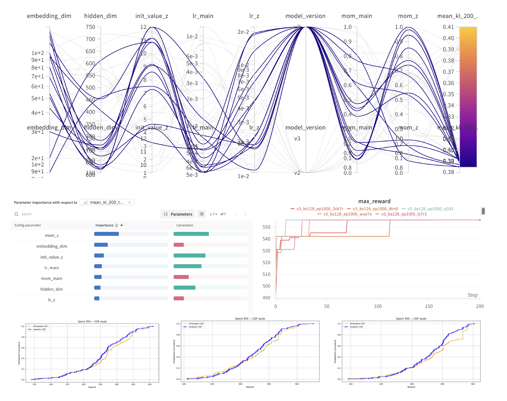

# 🧠 Knapsack GFlowNet  
_Efficient, probabilistic 0‑1 Knapsack optimisation for Economists, OR folks and ML Engineers_

---

## 🚀 One‑Minute Pitch

The classic **0‑1 Knapsack** problem asks:  
*Which items do I pick to maximize total value without exceeding my budget?*

Every choice is discrete—you either take an item (`1`) or skip it (`0`).  
This simple rule creates sequences like `0 1 0 1 …` across multiple items,  
leading to **2ⁿ possible combinations**—an exponential complexity nightmare.

Rather than brute-forcing every possibility,  
a **Generative Flow Network (GFlowNet)** learns a **probability distribution**  
over the entire space of combinations, guiding you probabilistically toward the best solutions.

### 🔧 How does it work?

The GFlowNet looks at four simple things at each decision step:

1. **Item utilities** *(how valuable is each item?)*  
2. **Item prices** *(what does each item cost?)*  
3. **Remaining budget** *(how much money is left?)*  
4. **Items already picked or skipped**

It outputs exactly **one number**—a probability between 0 and 1.  
You take this probability and **flip a loaded coin**: pick or skip the item, building up a decision sequence step by step.  
You repeat this process **128 times in parallel**, so the model quickly learns where the best solutions lie.

### 🧠 Where does Z come in?

Each sequence you create has a **reward** (e.g., total value in utility). But rewards are arbitrary numbers, not probabilities—they don’t sum to 1 naturally.

To fix this, we introduce **Z**, a learnable parameter:

$$P(\text{sequence}) = \frac{\text{reward(sequence)}}{Z}$$

**Z** converts raw rewards into a proper probability distribution.  
It acts like a **currency converter**—turning arbitrary reward values into probabilities.  
The model continuously adjusts **Z** during training to ensure that probabilities match their rewards proportionally.  

Put simply:  
- High-reward solutions → higher probabilities  
- Lower-reward solutions → lower probabilities  
- Total probability always sums neatly to 1, thanks to Z

With this smart, self-balancing system,  
for *n = 15* items, the global optimum usually emerges after about **5,120 samples**, instead of naively checking **all 32,768 possibilities**.

---

### 💥 Summary

The GFlowNet doesn’t just search blindly —  
it **learns to guide probability flow** toward high-value solutions,  
turning a combinatorial explosion into an efficient, scalable process.

---

## 👥 Audience Cheat‑Sheet

| You are… | Read **first** | Why this repo is useful |
|----------|---------------|-------------------------|
| **🎓 Economist** (no heavy maths / AI) | `0_A-ECON.md` | The model learns to guide sampling toward the best solutions, without needing to explore everything exhaustively |
| **🛠 OR / Optimisation** | `0_B-OR.md` | Think *Monte‑Carlo DP × Normalising Flows* – sample instead of enumerate |
| **🤖 ML / AI Engineer** | `0_C-ML.md` | Trajectory‑Balance loss, GPU batching, W&B sweeps, three state encodings |

> Each primer is two paragraphs; skip what you already know.

---

## 🗂️ Repository Layout

```
.
├── assets/                    # Images for README (graphs, results)
│   ├── Multi.png              # Hyperparameter sweep & CDF plots
│   └── ...                    # (other visuals if needed)
├── data/                      # Pickled toy instance (u, t, B)
│   └── data.pickle
├── env/
│   └── environment.yaml       # Conda definition (Python 3.13.2)
├── metrics/
│   └── probability_distribution_on_batch.py
├── models/                    # Three GFlowNet variants
│   ├── baseline_v1.py         # v1 – budget-blind
│   ├── block_traj_v2.py       # v2 – online blocking
│   └── remaining_budget_v3.py # v3 – dynamic budget ✅ best
├── reward/
│   ├── analytical_reward.py   # Brute-force oracle (≤20 items)
│   └── reward.py              # Batch reward computation
├── sweep/
│   └── sweep.yaml             # W&B Bayesian optimisation config
├── train.py                   # 🏁 Entry-point
├── requirements.txt           # pip alternative to Conda
└── README.md                  # ← you are here
```

*(A local `wandb/` directory is created at run‑time; add it to `.gitignore`.)*

---

## 🔬 Algorithm in a Nutshell
1. **State** = `(-1, 0, 1)` code for each item + **remaining budget** (v3).  
2. **Policy** `π_θ(a | s)` queried for 128 states **in parallel**.  
3. **Collapsed Trajectory-Balance**  

   $$
   \mathcal{L}(\tau) = \left( \log P_\theta(\tau) + \log Z_\theta - \log R(\tau) \right)^2
   $$

   with a learnable scalar `log Z`.  
4. Gradient step → discard batch → sample a fresh one. Eventually every leaf is visited stochastically.

---

## 📈 Key Results

### 📄 Full Report

For a detailed analysis of the experiments, including additional figures and discussion:
👉 **[Read the full report here](https://api.wandb.ai/links/arthurmaffre-alone/u6krh0mc)**

### 📊 Hyperparameter Sweep Results



The following figure shows:
- The **parallel coordinates** of hyperparameter influence on KL divergence.
- **Max reward** evolution across different runs.
- **CDF alignment** between sampled and analytical distributions.

_Interactive dashboards on Weights & Biases project **gflownet‑knapsack**._

---

## ⚡ Quick‑Start

### 1 · Environment

```bash
git clone https://github.com/your‑handle/gflownet‑knapsack.git
cd gflownet‑knapsack

conda env create -f env/environment.yaml
conda activate gflownet-knapsack
# or  python -m pip install -r requirements.txt
```

### 2 · Train

```bash
python train.py --model_version v3 --num_epochs 1000 --batch_size 128
```

Dataset default: `data/data.pickle` – override with `--data_path`.

### 3 · Hyper‑parameter sweep (optional)

```bash
wandb sweep sweep/sweep.yaml
wandb agent <entity>/<project>/<sweep-id>
```

Objective = minimise **mean_kl_200_to_end**.

---

## 💾 Data Format

```python
{
  "u": torch.FloatTensor(n),  # utilities
  "t": torch.FloatTensor(n),  # costs
  "B": float                  # budget
}
```

---

## 🛠 Extensions
* **Bilevel optimisation** – reuse across similar instances.  
* **Transformer encoder** – scale beyond 25 items.  
* **Distributed training** – multi‑GPU / multi‑node.

PRs welcome!

---

## 📜 Licence
MIT

> _Made with ❤️ & a MacBook Air (M2) chilled on an ice‑pack._
